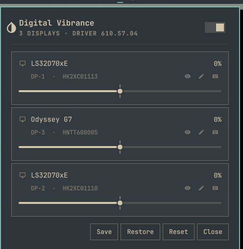

# Omavibrance

Control NVIDIA digital vibrance for every connected display from the Omarchy
bar, using [`nvibrant`](https://github.com/Tremeschin/nvibrant).

## Features

- One card per connected display, each with a full-width continuous slider
  marked at neutral, its reading above the track, and an exact numeric field a
  button away. The scale runs -100% (grayscale) to +100% (max saturation),
  matching how nvidia-settings presents the setting.
- A master switch in the header **bypasses** vibrance — every display goes
  neutral while the panel keeps showing, and letting you keep editing, the
  values it will return to.
- Displays are named from their EDID (`Odyssey G7`, `DP-3`, serial) and listed
  left to right in the order they sit on your desk.
- **Identify** flashes one display between grayscale and full saturation, so you
  can tell which row drives which monitor — it works even while bypassed. **Rename**
  a row to whatever you actually call it; Enter or the check saves, Escape or the
  cross discards.
- **Save** pins the current values; **Restore** comes back to them after
  experimenting. Live values are also persisted continuously and re-applied when
  the shell restarts, since `nvibrant` has no way to read back what is set.
- Right-click a slider to return that display to neutral; **Reset** neutralizes
  all of them.
- Warns in the panel if `nvibrant` is missing or an invocation fails.

## Prerequisites

`nvibrant` must be installed and on `PATH` (`nvibrant-bin` on Arch). It needs
`nvidia_drm.modeset=1`, since it drives `/dev/nvidia-modeset` directly.

## Installation

Copy this directory to `~/.config/omarchy/plugins/com.github.marvreichmann.omavibrance/`,
then add the **Omavibrance** widget to your bar. Adding the widget is what
enables the plugin, which in turn starts its service.

## Notes on `nvibrant`

`nvibrant` has no query mode and no flags — it takes one positional value per
display index, clamps each to `-1024..1023`, and prints the resulting table.
Three consequences shape this plugin:

- Enumerating displays is itself a write, so the plugin persists its values to
  `$XDG_STATE_HOME/omarchy/omavibrance.json` and re-applies them at startup.
- Changing one display means re-sending every display's value, so the service
  owns the whole array.
- Indices are positional and include disconnected outputs. Those are kept in the
  array as placeholders but hidden from the panel.

Only the first GPU is controlled. `nvibrant` selects a GPU with the `NVIDIA_GPU`
environment variable; multi-GPU support is not implemented.

The `nvibrant` on `PATH` is a Python launcher that picks a bundled per-driver
binary and execs it, costing ~28 ms of interpreter startup per call. The plugin
asks it once for that path and then invokes the binary directly, which is most
of what makes dragging a slider feel immediate. If the direct call fails it
falls back to the launcher.

## How displays are identified

`nvibrant` reports a connector family and a positional index; Hyprland reports
an output name, make/model/serial, and a desktop position. Nothing in either
output is a shared key, so the two are correlated by ordering within a connector
family: the *n*-th connected DP row is matched to the *n*-th `DP-` output.

That holds on ordinary setups but is a heuristic, not a lookup — which is why
every row has an **identify** pulse to confirm it and a **rename** to override
it. Custom names are stored in the same state file and survive the mapping
changing under them.

## License

MIT — see [LICENSE](LICENSE).
